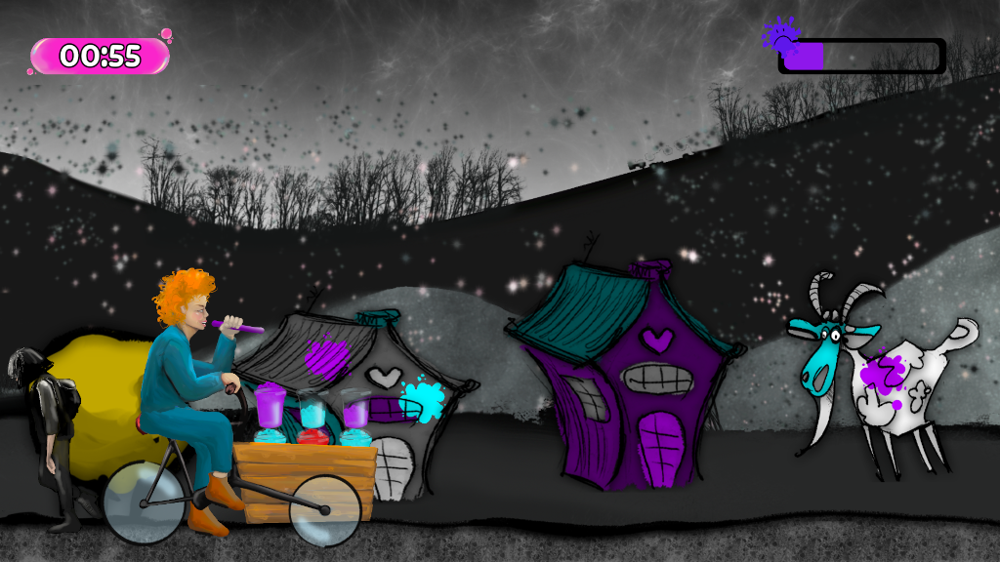

# Bubble Tearapy - GGJ25 - Ouebsson France 

Bring color and joy to a gray, lifeless world.

## Requirements

[Node.js](https://nodejs.org) is required to install dependencies and run scripts via `npm`.

## Available Commands

| Command               | Description |
|-----------------------|-------------|
| `yarn install`        | Install project dependencies |
| `yarn dev`            | Launch a development web server |
| `yarn build`          | Create a production build in the `dist` folder |

## Deploying to Production

After you run the `yarn build` command, your code will be built into a single bundle and saved to the `dist` folder, along with any other assets your project imported, or stored in the public assets folder.

In order to deploy your game, you will need to upload *all* of the contents of the `dist` folder to a public facing web server.

## Credits

Authors : [Ouebsson GGJ25](mailto:bonjour@ouebsson.fr) (https://studio.ouebsson.fr/)

Read the [CREDITS.md](CREDITS.md) file to discover all the wonderful humans who add color to this game.

Created with [Phaser](https://phaser.io)

## Licence

[Attribution-NonCommercial-ShareAlike 4.0 International](https://creativecommons.org/licenses/by-nc-sa/4.0/)